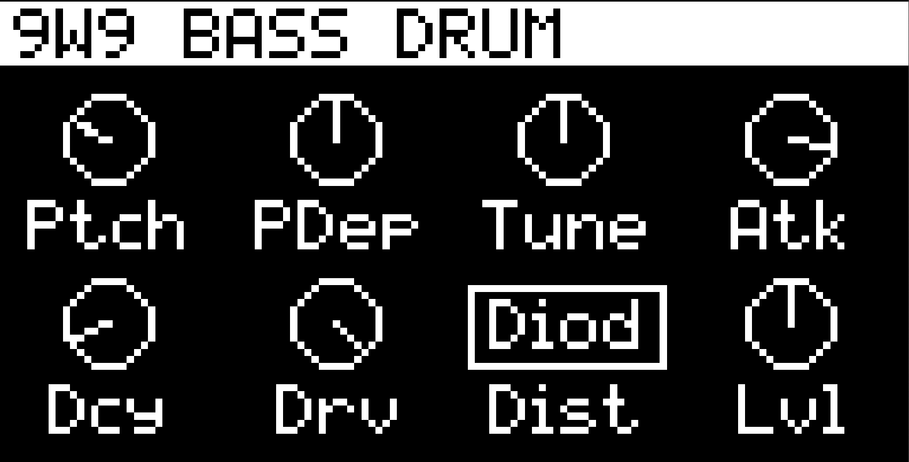
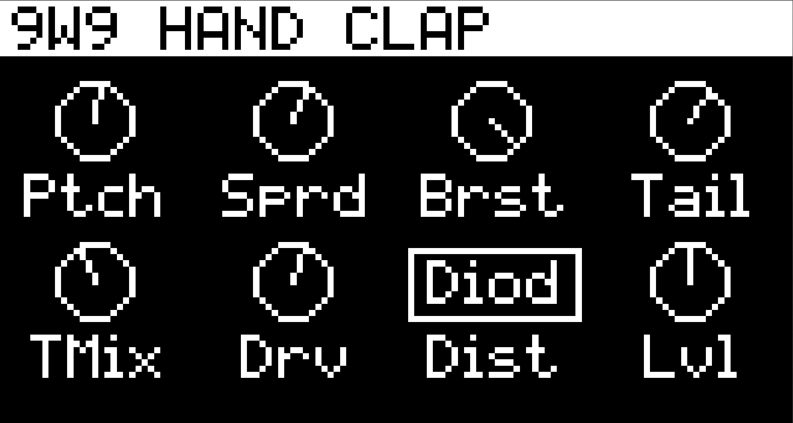
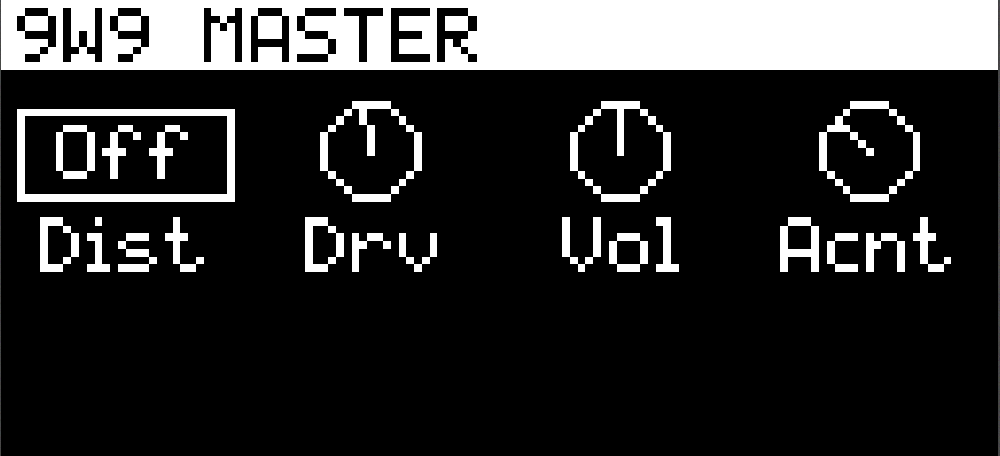

# 9W9 — Rhythm Composer for Ableton Move

A TR-909 style drum machine for [Schwung](https://github.com/charlesvestal/schwung)
on Ableton Move. Circuit-modelled kick, snare, toms, rim shot and hand clap;
sampled hi-hats, ride and crash — the same split the real TR-909 used.





## Voices

| Voice | Engine |
|---|---|
| Bass Drum | Diode-rounded triangle, pitch sweep, beater click (impulse + LP noise), **sub layer**, **asymmetric tube stage**, **per-hit drift** |
| Snare | Two tuned shells + snappy noise with its own envelope and tone |
| Toms (L/M/H) | Body oscillator pair with pitch sweep |
| Rim Shot | Trigger pulse shock-exciting two resonators (body "tock" + edge "tick") |
| Hand Clap | Noise through a bandpass, gated by a 3-pulse burst + room tail |
| Hats / Ride / Crash | Sampled — the real 909's cymbals are 6-bit PCM, so this is accuracy, not shortcut |

Every voice has **Drive** and a **Distortion type** (Diode / Hard Clip /
Wavefolder / Bitcrush), plus a **Master Drive/Distortion** across the kit.
Every continuous control is a **0–127 pot**, like the hardware — no Hz, no ms.

## Workflow on the Move

- **Pads (left 4×4)** play and select drums; the parameter page follows what
  you hit. **Shift+Pad** selects silently (works during playback).
  **Mute+Pad** mutes that drum (`[M]` in the title bar).
- **Knobs 1–8** edit the visible page, drawn with Schwung's stock
  Movy-style knob grid (host 0.12.1+): **jog** cycles pages, **Shift+Jog**
  jumps sections, **jog click** opens the section list, **Shift** reveals
  values / fine mode, **Mute+knob** resets a pot. Pad 16 opens **Master**.
- **Sequencing:** use Move's own sequencer — a drum track with a kit, muted
  (HiJack), track MIDI OUT on the slot's channel. Each drum is its own lane.
  Note map: drum rack (36–46, default) or General MIDI, switchable.
- Works with [Movy](https://github.com/DimaDake/schwung-movy) — a
  `movy_config.json` ships with the module.

## Remote panel

A full 909-style editor in the browser — every drum section with draggable
knobs, per-drum **MUTE** buttons (synced with Mute+Pad on the device),
distortion selectors, and the Master section. Open
`move.local:7700/remote-ui` while 9W9 is the slot's synth.


## Install

Requires Schwung **0.12.1 or newer**. Via the Schwung Module Store /
[schwung-manager](https://github.com/charlesvestal/schwung), or manually: build, then copy `dist/9w9/` to
`/data/UserData/schwung/modules/sound_generators/9w9/` on the device.

## Building

Requires Docker (cross-compiles for the Move's ARM64, pinned to glibc 2.35):

```bash
./scripts/build.sh er99          # builds build/dsp.so + dist/9w9-module.tar.gz
./scripts/deploy.sh <host>       # safe deploy (atomic rename, never over a live .so)
```

`scripts/build.sh er99_loadtest` builds an on-device test that dlopens the real
`dsp.so` exactly as Schwung's chain host does and verifies parameters, state
round-trip, sequencer audio and mutes end to end.

## Credits and provenance

9W9 stands on other people's work and says so:

- **[ER-99](https://github.com/matthewcieplak/er-99)** by Matthew Cieplak
  (GPL-3.0) — the project 9W9 started from. The engine began as a faithful C
  port of ER-99's Web Audio graph, and the **hi-hat, ride and crash samples
  ship directly from ER-99**. The original ER-99 voice engine is still
  included and selectable (`Engine: er-99`).
- **[niner](https://github.com/hyperfocusdsp/niner)** by hyperfocusdsp
  (GPL-3.0) — the kick architecture (layered sub, stacked saturation stages,
  per-hit drift) is modelled on niner's design. No code was copied; the ideas
  were.
- **[Movy](https://github.com/DimaDake/schwung-movy)** by DimaDake (MIT) —
  the on-device knob-dial look is drawn after Movy's renderer, and the Movy
  integration template follows its documented format.
- **[Schwung](https://github.com/charlesvestal/schwung)** by Charles Vestal
  and contributors — the framework that makes any of this possible.
- TR-909 voice behaviour informed by the
  [Network-909 circuit analysis](http://www.network-909.de/circuit.htm) and
  the [firstpr.com.au TR-909 sound-mod notes](https://www.firstpr.com.au/rwi/tr-909/TR-909-Sound-Mods.pdf)
  (Pitch / Tune-Depth / Tune-Decay behaviour).

This project was developed with AI assistance (Claude), with human direction
and on-hardware verification throughout.

## Contributing

**Contributions are open to anyone, any time — just submit a PR.** Voice
tweaks, new distortion flavours, UI improvements, Movy templates, docs, bug
reports: all welcome. Please note in your PR which AI tools you used, if any
(same policy as Schwung upstream).

## License

GPL-3.0 — see [LICENSE](LICENSE). ER-99-derived code and samples keep their
GPL-3.0 licensing; niner is credited as design inspiration under the same
license family.

## Disclaimer

Not affiliated with, approved or endorsed by Ableton or Roland. TR-909 and
RD-9 are trademarks of their respective owners, referenced only to describe
behaviour.
