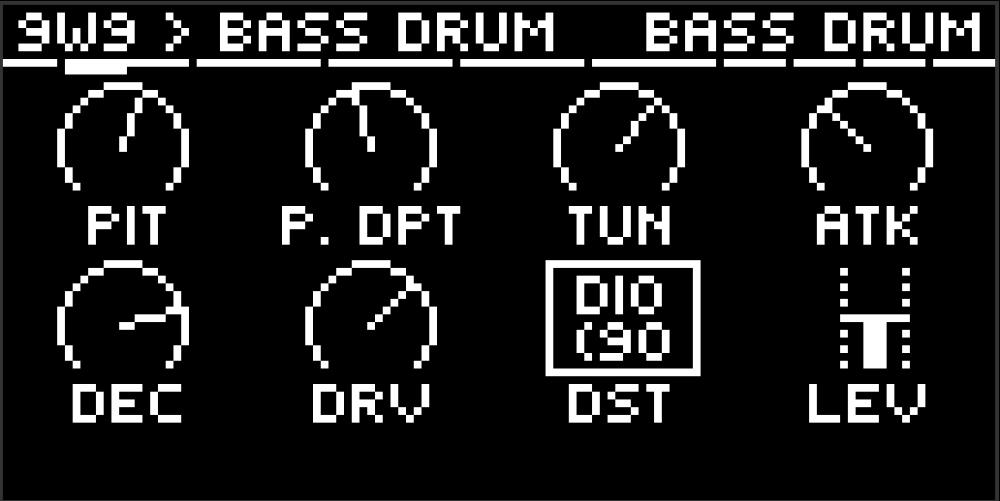
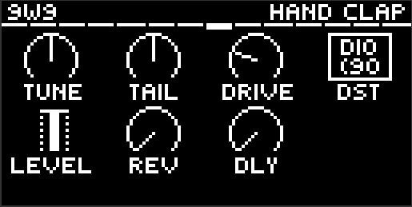
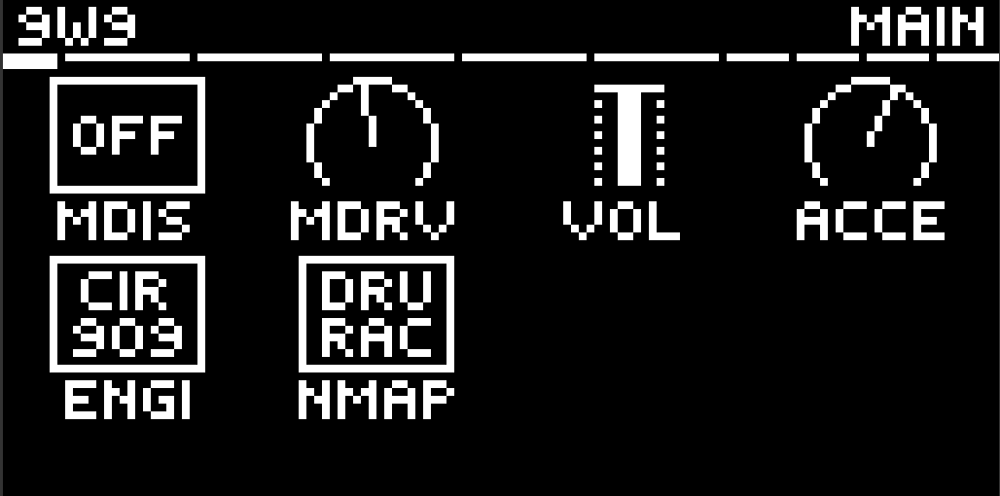
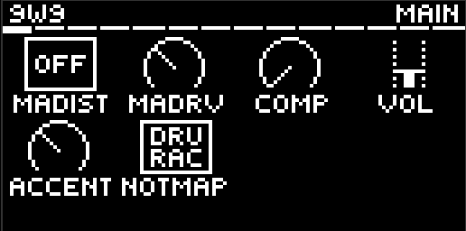
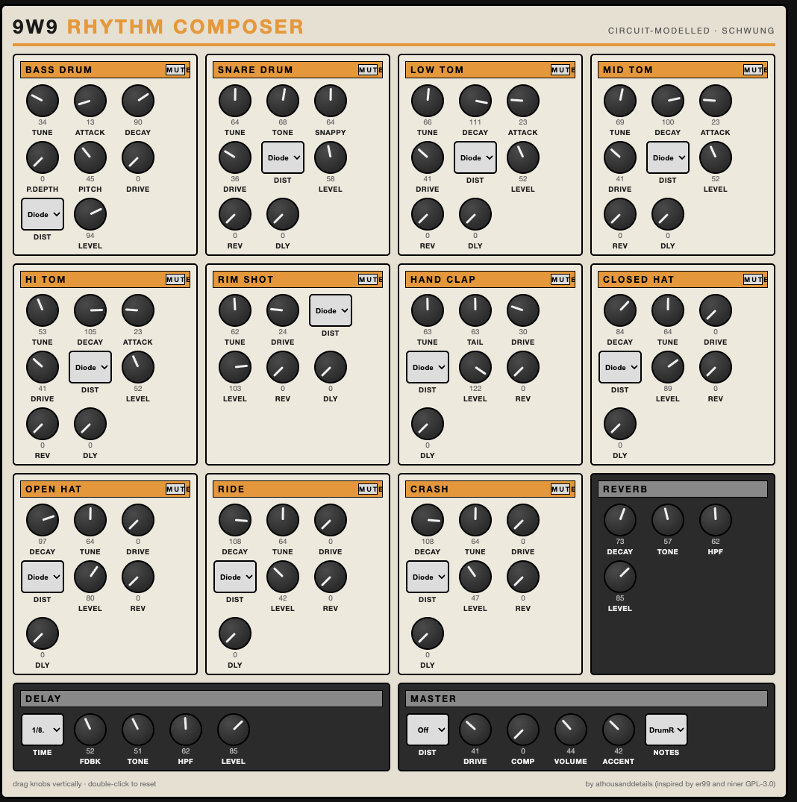

# 9W9 — Rhythm Composer for Ableton Move

A TR-909 style drum machine for [Schwung](https://github.com/charlesvestal/schwung)
on Ableton Move. Circuit-modelled kick, snare, toms, rim shot and hand clap;
sampled hi-hats, ride and crash — the same split the real TR-909 used.






## Voices

9W9 models the circuit, then checks the result against hardware recordings;
where the two disagree, the schematic wins and the sound is re-fitted.

| Voice | Engine |
|---|---|
| Bass Drum | VCO at a fixed ~49 Hz base with the 909's additive-exponential sweep, 16 ms pitch hold, diode rounding and beater click. **Tune** is the sweep ladder, exactly as on the panel. Optional **Pitch / P.Depth** modulation, gated so it does nothing at all until P.Depth leaves zero |
| Snare | Two shells a 1.585 ratio apart off one CV, plus the ENV4 noise channel — 24 ms plateau, accelerated fall, and the VCA's soft cutoff knee rather than a hard gate. Panel is the 909's own: Tune, Tone, Snappy, Level |
| Toms (L/M/H) | Three VCOs per drum at the measured 1 : 1.50 : 2.75 partials, the upper two attack-only. Tune ranges are trimmed so the three toms cannot be tuned onto each other, like the hardware |
| Rim Shot | Trigger pulse shock-exciting two resonators — body "tock" and edge "tick" |
| Hand Clap | Four rising echoes 12 ms apart into a noise band, with the room tail running off the main hit |
| Hats / Ride / Crash | Sampled — the real 909's cymbals are 6-bit PCM, so this is accuracy, not shortcut. Closed and open hat have their own pages and choke each other |

Every voice has **Drive** and a **Distortion type**, plus a **Master
Drive/Distortion** across the kit. Seven characters, transparent at the bottom
of the Drive range and growing from there:

| | |
|---|---|
| **Diode** | the 909's own back-to-back diode rounding |
| **Clip** | asymmetric soft clip, even harmonics and all |
| **SAT** | warm parallel saturation that keeps the transient |
| **BFZ** | thick fuzz wall |
| **PDIST** | biased cubic crunch |
| **Fold** | wavefolder, metallic without hollowing the note out |
| **Crush** | bit depth and sample rate falling together |

Every continuous control is a **0–127 pot**, like the hardware — no Hz, no ms.

## Send FX

Two send effects, on their own pages at the end of the list. Every voice
**except the kick** has a **Rev** and **Dly** send; the kick stays dry on
purpose. The returns join the bus before the master stages, so Master
Drive/Distortion and the Comp work on the wet signal too.

- **Reverb** — four combs and two allpasses with the loop quantised to 12
  bits, for the early-rack grain. Decay, Tone (loop damping), HPF, Level.
- **Delay** — **Time is a note division**, synced to Move's tempo: 1/32,
  1/16T, 1/16, 1/8T, 1/16., 1/8, 1/4T, 1/8., 1/4, 1/2T, 1/4., 1/2, 1/2.
  The line is slewed, so changing tempo or division warps the echo like tape
  instead of clicking. Fdbk, Tone, HPF, Level.

Each has an input **HPF** so low end can be kept out of the wet path.

## Master

**Master Dist** and **Drive** across the kit, a one-knob **Comp** for glue
(hard bypass at zero, with AutoGain fitted so loudness stays flat as you turn
it up), **Volume**, **Accent**, **Velocity**, and the **Note Map** switch.
There is no always-on compressor or limiter anywhere else in the signal path.

**Accent** is the level a full-velocity hit reaches — the 909's accent bus, and
the level this kit plays at from a sequencer. **Velocity** is how far *below*
Accent a softer hit falls. The knob only ever carves downwards, so turning it
up changes the kit's dynamics and never its loudness or balance. At **0**
velocity is ignored entirely and everything plays straight at Accent. Turn it
up and the range opens: about 2 dB softest-to-hardest at a quarter, 4.6 dB at
half, 15.4 dB wide open.

(The hardware accents with a per-step *switch* — one level under a threshold,
another over it — and modelling that literally left a 6 dB cliff between
velocity 99 and 100 with flat shelves either side, which is not how anything
driven from a sequencer expects to behave. The threshold is gone; Accent
remains as the top of the range, so with Velocity at 0 the kit is bit-identical
to how it played before velocity existed.)

## Workflow on the Move

- **Pads (left 4×4)** play and select drums; the parameter page follows what
  you hit. **Shift+Pad** selects silently (works during playback).
  **Mute+Pad** mutes that drum (`[M]` in the title bar).
- The **last two pads** open **Reverb** and **Delay**; the pad after the kit
  opens **Main**. These three only switch the page — they never sound.
- **Main-page lock:** **Shift + jog click while on Main** locks it (`[L]` in
  the title bar). A plain jog click stays Schwung's — it opens the section list,
  and activates rows on the **My Presets** and **Module** pages. Pads still play and record, but the page stops following
  them, so the master knobs stay under your hands while you jam. Shift+Pad
  still selects, and another jog click unlocks.
- **Knobs 1–8** edit the visible page, drawn with Schwung's stock
  knob grid (host 0.12.1+): **jog** cycles pages, **Shift+Jog**
  jumps sections, **jog click** opens the section list, **Shift** reveals
  values / fine mode, **Mute+knob** resets a pot.
- **Sequencing:** use Move's own sequencer — a drum track with a kit, muted
  (HiJack), track MIDI OUT on the slot's channel. Each drum is its own lane.
  Note map: drum rack (36–46, default) or General MIDI, switchable.

## Remote panel

A full 909-style editor in the browser — every drum section with draggable
knobs, per-drum **MUTE** buttons (synced with Mute+Pad on the device),
distortion selectors, the Reverb and Delay sections, and Master. Open
`move.local:7700/remote-ui` while 9W9 is the slot's synth.



## Install

Requires Schwung **0.12.1 or newer**. Via the Schwung Module Store /
[schwung-manager](https://github.com/charlesvestal/schwung), or manually: build, then copy `dist/9w9/` to
`/data/UserData/schwung/modules/sound_generators/9w9/` on the device.

## Building

Requires Docker (cross-compiles for the Move's ARM64, pinned to glibc 2.35):

```bash
./scripts/build.sh er99          # builds build/dsp.so + dist/9w9-module.tar.gz
./scripts/deploy.sh <host>       # safe deploy (atomic rename, never over a live .so)
```

`scripts/build.sh er99_loadtest` builds an on-device test that dlopens the real
`dsp.so` exactly as Schwung's chain host does and verifies parameters, state
round-trip, mutes, the hat choke, channel balance and the send FX end to end.

## Credits and provenance

9W9 stands on other people's work and says so:

- **[ER-99](https://github.com/matthewcieplak/er-99)** by Matthew Cieplak
  (GPL-3.0) — the project 9W9 started from. The engine began as a C port of
  ER-99's Web Audio graph. That engine has since been replaced voice by voice
  with circuit models and removed, but the **hi-hat, ride and crash samples
  ship directly from ER-99** and 9W9 would not exist without it.
- **[Schwung](https://github.com/charlesvestal/schwung)** by Charles Vestal
  and contributors — the framework that makes any of this possible.
- Voice behaviour worked out from the **TR-909 service notes** (schematics and
  scope traces), the
  [Network-909 circuit analysis](http://www.network-909.de/circuit.htm), Colin
  Fraser's TR-909 bass drum analysis, and the
  [firstpr.com.au TR-909 sound-mod notes](https://www.firstpr.com.au/rwi/tr-909/TR-909-Sound-Mods.pdf)
  (Pitch / Tune-Depth / Tune-Decay behaviour).

This project was developed with AI assistance (Claude), with human direction
and on-hardware verification throughout.

## Contributing

**Contributions are open to anyone, any time — just submit a PR.** Voice
tweaks, new distortion flavours, UI improvements, docs, bug
reports: all welcome. Please note in your PR which AI tools you used, if any
(same policy as Schwung upstream).

## License

GPL-3.0 — see [LICENSE](LICENSE). ER-99-derived code and samples keep their
GPL-3.0 licensing.

## Disclaimer

Not affiliated with, approved or endorsed by Ableton or Roland. TR-909 and
RD-9 are trademarks of their respective owners, referenced only to describe
behaviour.
